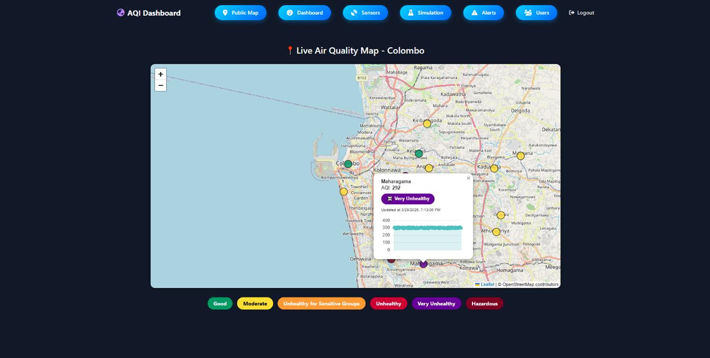
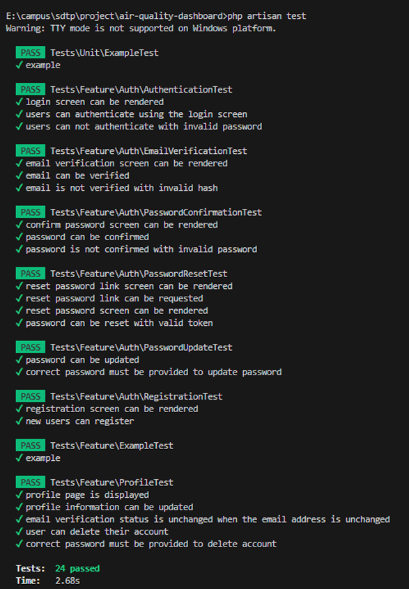
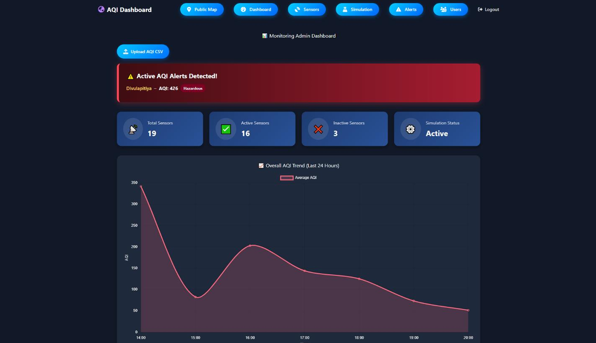
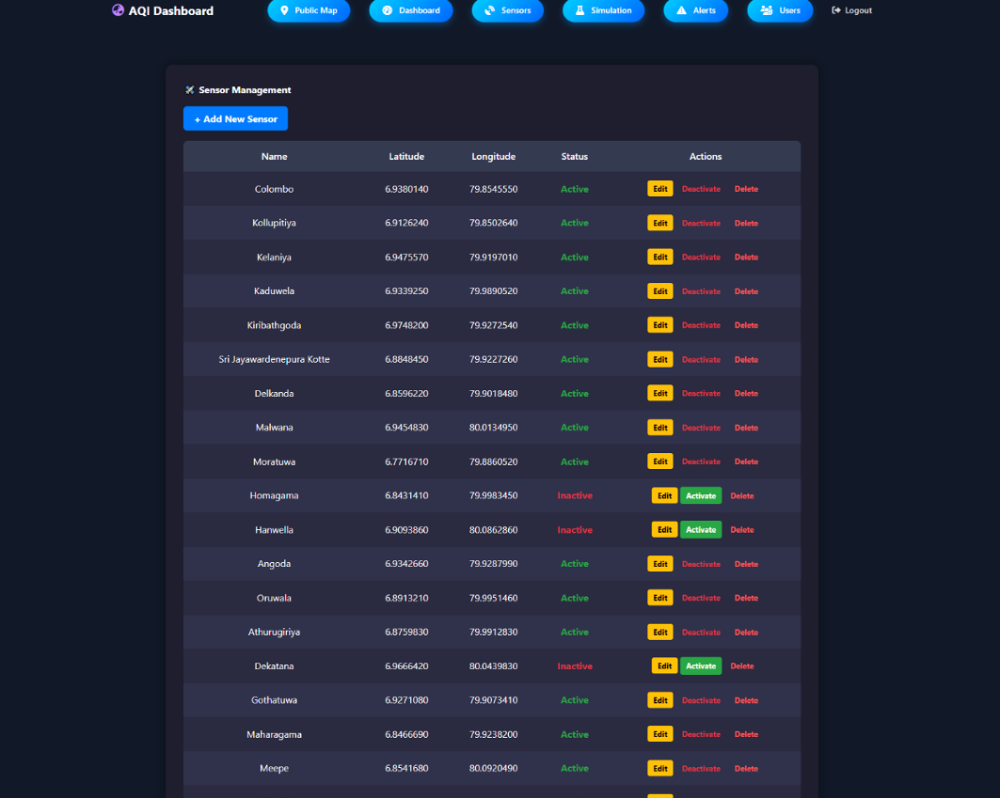
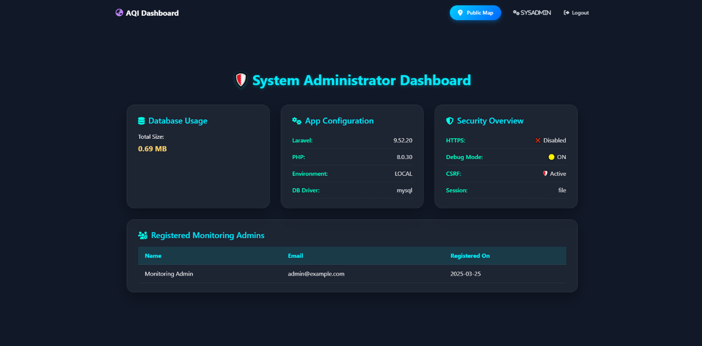

# 💨 Air Quality Monitoring Dashboard

A comprehensive web-based platform for monitoring air quality data in the Colombo Metropolitan Area. This system provides real-time Air Quality Index (AQI) visualization through interactive maps and role-based access control for different user types.



## 🌟 Features

### Core Functionality
- **Real-time AQI Monitoring**: Live air quality data visualization with automatic updates every 5 minutes
- **Interactive Map Interface**: Leaflet.js-powered map with color-coded markers representing AQI levels
- **Data Simulation Engine**: Automated AQI data generation with realistic patterns including random fluctuations, sine wave patterns, and peak-hour variations
- **Alert System**: Automatic notifications when AQI levels exceed unhealthy thresholds (>200)
- **CSV Data Import**: Bulk sensor data upload functionality

### User Management & Security
- **Role-Based Access Control**: Three distinct user roles with appropriate permissions
  - **Public Users**: Read-only access to public map
  - **Monitoring Admins**: Sensor management and AQI data monitoring
  - **System Admins**: Full system access including user management and diagnostics
- **Secure Authentication**: Laravel-based authentication with middleware protection
- **Session Management**: Secure session handling with CSRF protection

### Administrative Features
- **Sensor Management**: Create, edit, and deactivate air quality sensors
- **User Management**: Admin panel for user account creation and management
- **System Diagnostics**: Comprehensive system information dashboard
- **Alert Configuration**: Customizable AQI threshold settings

## 🛠 Tech Stack

### Backend
- **Framework**: Laravel (PHP)
- **Database**: MySQL
- **Testing**: PHPUnit for unit and integration testing
- **API**: RESTful API endpoints with JSON responses

### Frontend
- **Mapping**: Leaflet.js for interactive map visualization
- **UI/UX**: Responsive design with Bootstrap
- **Real-time Updates**: AJAX-based data fetching
- **Charts**: Historical AQI data visualization

### Development Tools
- **Version Control**: Git
- **API Testing**: Postman
- **Database Management**: phpMyAdmin
- **Code Editor**: VS Code

## 📋 Prerequisites

- PHP >= 7.4
- Composer
- MySQL >= 5.7
- Node.js & NPM
- Web server (Apache/Nginx)

## 🚀 Installation

1. **Clone the repository**
   ```bash
   git clone https://github.com/deaneeth/aqi-monitoring-system
   cd aqi-monitoring-system
   ```

2. **Install PHP dependencies**
   ```bash
   composer install
   ```

3. **Install JavaScript dependencies**
   ```bash
   npm install
   ```

4. **Environment configuration**
   ```bash
   cp .env.example .env
   php artisan key:generate
   ```

5. **Configure database**
   - Update `.env` file with your database credentials
   ```
   DB_CONNECTION=mysql
   DB_HOST=127.0.0.1
   DB_PORT=3306
   DB_DATABASE=aqi_monitoring
   DB_USERNAME=your_username
   DB_PASSWORD=your_password
   ```

6. **Run database migrations**
   ```bash
   php artisan migrate
   ```

7. **Seed the database (optional)**
   ```bash
   php artisan db:seed
   ```

8. **Build frontend assets**
   ```bash
   npm run dev
   ```

9. **Start the development server**
   ```bash
   php artisan serve
   ```

## 🧪 Testing

### Testing Coverage

*Comprehensive PHPUnit testing suite ensuring code quality and reliability*

### Unit Tests
Run individual component tests:
```bash
php artisan test --testsuite=Unit
```

### Integration Tests
Test API endpoints and database interactions:
```bash
php artisan test --testsuite=Feature
```

### Manual Testing
- Use Postman collection for API endpoint testing
- Browser developer tools for frontend validation
- Cross-browser testing (Chrome, Firefox)

## 📊 Database Schema

### Main Tables
- **sensors**: Sensor location and configuration data
- **sensor_data**: Historical AQI measurements
- **users**: User accounts and role assignments
- **alerts**: System-generated alerts for threshold violations

## 🎯 Usage

### For Public Users
1. Navigate to the public map interface
2. View real-time AQI data through color-coded markers
3. Click markers to see detailed AQI information and historical charts

### For Monitoring Admins
1. Log in through the admin panel
2. Manage sensors (create, edit, deactivate)
3. Monitor real-time AQI data and alerts
4. Configure alert thresholds
5. Upload CSV data for bulk sensor management

### For System Admins
1. Access full system diagnostics
2. Manage user accounts and permissions
3. View system configuration and health metrics
4. Monitor application performance

## 🚨 AQI Alert System

The system automatically generates alerts based on standard AQI categories:
- **Good (0-50)**: Green markers
- **Moderate (51-100)**: Yellow markers
- **Unhealthy for Sensitive Groups (101-150)**: Orange markers
- **Unhealthy (151-200)**: Red markers
- **Very Unhealthy (201-300)**: Purple markers
- **Hazardous (301+)**: Maroon markers

Alerts are triggered when AQI levels exceed 200 (Unhealthy threshold).

## 🔧 Configuration

### AQI Simulation
Configure simulation parameters in the admin dashboard:
- Data generation intervals (default: 5 minutes)
- AQI value ranges and patterns
- Peak hour variations

### Alert Thresholds
Customize alert triggers through the configuration panel:
- Set custom AQI thresholds
- Configure notification preferences
- Manage alert recipients

## 📱 Responsive Design

The application is fully responsive and tested across:
- Desktop browsers (Chrome, Firefox, Safari)
- Tablet devices
- Mobile phones

## 🤝 Contributing

1. Fork the repository
2. Create a feature branch (`git checkout -b feature/amazing-feature`)
3. Commit your changes (`git commit -m 'Add amazing feature'`)
4. Push to the branch (`git push origin feature/amazing-feature`)
5. Open a Pull Request

## 📝 License

This project is licensed under the MIT License - see the [LICENSE](LICENSE) file for details.

## 🎓 Academic Context

This project was developed as part of the Software Development Tools and Practices (PUSL2020) module, demonstrating practical application of:
- Full-stack web development
- Real-time data simulation
- Geographic information systems
- Software testing methodologies
- Version control and collaborative development

## 📸 Screenshots

### Public Map Interface

*Interactive map showing real-time AQI data with color-coded markers for different pollution levels*

### Admin Dashboard

*Comprehensive admin interface with system overview, alerts, and quick access to management tools*

### Sensor Management

*Intuitive interface for managing air quality sensors, including location data and status monitoring*

### System Administration

*Advanced system diagnostics and configuration panel for system administrators*


> 📋 **View all screenshots and detailed interface documentation in [SCREENSHOTS.md](SCREENSHOTS.md)**

## 📞 Support

For questions or support, please open an issue on GitHub or contact the repository maintainer.

---

**Note**: This system uses simulated data for demonstration purposes. For production deployment with real sensor data, additional configuration and hardware integration would be required.
