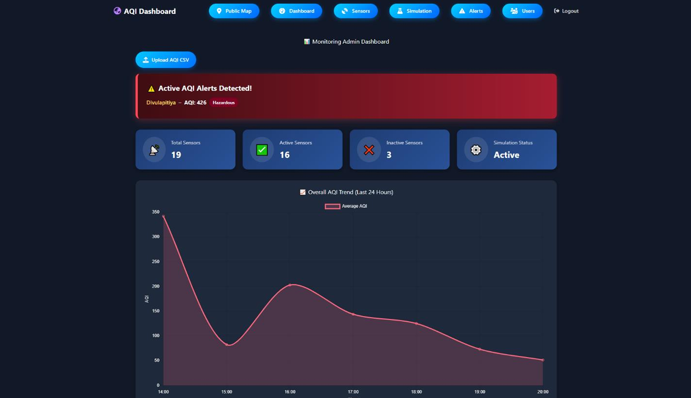
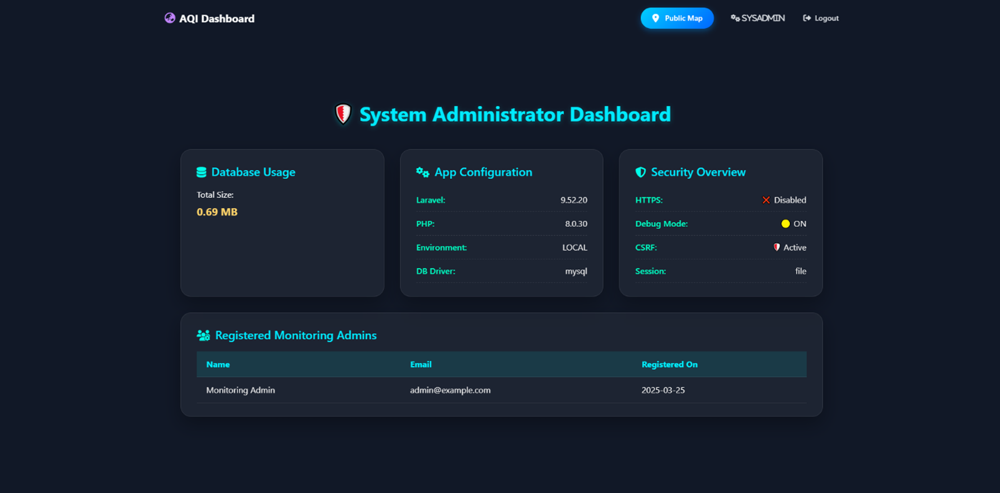

# 📸 Interface Screenshots & Documentation

This document provides a comprehensive visual overview of the Air Quality Monitoring Dashboard interfaces and features.

## 🌍 Public Interface

### Public Map Page with Sensors

**Features Shown:**
- Interactive Leaflet.js map displaying Colombo Metropolitan Area
- Color-coded markers representing different AQI levels
- Real-time data updates every 5 minutes
- Marker popups with detailed AQI information
- Responsive design for various screen sizes

**User Access:** Available to all users (no login required)

---

## 👤 Admin Interfaces

### Admin Dashboard

**Features Shown:**
- System overview with key metrics
- Real-time alert notifications panel
- Quick access buttons to sensor management
- AQI status summary cards
- Navigation to various admin functions

**User Access:** Monitoring Admins and System Admins

### Sensor Management Page

**Features Shown:**
- List of all registered sensors with status indicators
- Sensor location and AQI data display
- Edit and delete functionality for each sensor
- Search and filter capabilities
- Bulk operations support

**User Access:** Monitoring Admins and System Admins

### Add New Sensor
.png)

**Features Shown:**
- Form for registering new air quality sensors
- Location input with coordinates
- Initial AQI value configuration
- Sensor ID and description fields
- Form validation and error handling

**User Access:** Monitoring Admins and System Admins

### Simulation Management Page

**Features Shown:**
- AQI data simulation controls
- Start/stop simulation toggle
- Simulation parameters configuration
- Data generation interval settings
- Real-time simulation status monitoring

**User Access:** Monitoring Admins and System Admins

### Alert Configuration Page

**Features Shown:**
- Customizable AQI threshold settings
- Alert notification preferences
- Historical alerts log
- Threshold level indicators (Good, Moderate, Unhealthy, etc.)
- Alert recipient management

**User Access:** Monitoring Admins and System Admins

---

## 🔧 System Administration

### System Admin Dashboard

**Features Shown:**
- Comprehensive system diagnostics
- Laravel framework information
- Database connection status
- Server environment details
- Security configuration overview
- Active sensors count and system health metrics

**User Access:** System Admins only

### User Management Page

**Features Shown:**
- Complete user accounts listing
- Role-based user categorization
- User status indicators (Active/Inactive)
- Edit and delete user functionality
- User search and filtering options

**User Access:** System Admins only

### Add New User
.png)

**Features Shown:**
- User registration form with role assignment
- Email and password configuration
- Role selection (Public User, Monitoring Admin, System Admin)
- User profile information fields
- Account activation settings

**User Access:** System Admins only

---

## 🧪 Development & Testing

### Unit Test Results

**Features Shown:**
- PHPUnit test execution results
- Test coverage for core functionalities
- Backend logic validation
- Sensor management testing
- AQI simulation testing
- Alert system validation

**Purpose:** Demonstrates code quality and reliability through automated testing

---

## 🎨 Design Features

### Responsive Design
- **Mobile-First Approach**: All interfaces are optimized for mobile devices
- **Cross-Browser Compatibility**: Tested on Chrome, Firefox, and Safari
- **Accessibility**: Proper contrast ratios and semantic markup
- **Color Coding**: Consistent AQI color scheme throughout the application

### User Experience
- **Intuitive Navigation**: Clear menu structure and breadcrumbs
- **Real-Time Updates**: Live data refresh without page reload
- **Error Handling**: User-friendly error messages and validation
- **Loading States**: Progress indicators for data-intensive operations

### Security Features
- **Role-Based Access**: Different interfaces for different user types
- **Session Management**: Secure authentication and session handling
- **CSRF Protection**: Forms protected against cross-site request forgery
- **Input Validation**: Server-side and client-side data validation

---

## 📱 Technical Implementation

### Frontend Technologies
- **Leaflet.js**: Interactive mapping and geospatial visualization
- **Bootstrap**: Responsive UI components and grid system
- **AJAX**: Asynchronous data loading and real-time updates
- **Chart.js**: Historical data visualization and trends

### Backend Architecture
- **Laravel MVC**: Clean separation of concerns
- **Eloquent ORM**: Database abstraction and relationships
- **Middleware**: Request filtering and authentication
- **Artisan Commands**: Custom CLI commands for simulation

### Database Design
- **Normalized Schema**: Efficient data storage and retrieval
- **Indexed Queries**: Optimized for real-time data access
- **Data Integrity**: Foreign key constraints and validation
- **Audit Trail**: Change tracking for critical operations

---

## 🚀 Performance Features

- **Optimized Queries**: Efficient database interactions
- **Caching Strategy**: Reduced server load through strategic caching
- **Asset Optimization**: Minified CSS and JavaScript
- **Image Optimization**: Compressed screenshots and assets
- **Progressive Loading**: Faster initial page load times

---

*Last Updated: 2025-06-10*
*For technical support or questions about these interfaces, please refer to the main README or open an issue.*